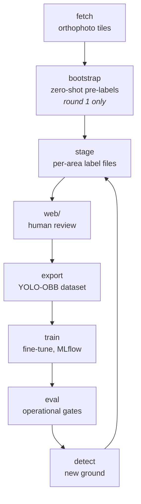

# rekka-ai

Truck (and other vehicle) detection from aerial images.

This is a model-training loop, not a straight-through pipeline: a pretrained
detector proposes, a human corrects, and each round the improved model
proposes the next batch on new ground.



**`bootstrap` was a one-shot.** It ran once, to get round one's labels started
from off-the-shelf DOTA weights so the first pass was correction rather than
drawing from scratch, and it has not been needed since. Every round after that
starts at `detect` with the weights the previous round produced:

```sh
uv run rekka-ai detect --aoi aois/helsinki.yaml --name <area> \
    --weights runs/train/round<N-1>/weights/best.pt \
    --confidence 0.25 --out data/candidates/roundN-<area>.geojson
```

The explicit `--confidence` is well below `detect`'s default, on purpose: the
default is the operating point a *census* ships at, and staging wants the
near-misses in front of the reviewer instead.

The command is kept for the cold start it exists for — a new city, or any
ground with no trained model yet — not as part of the round loop. It only
understands DOTA's `large vehicle`/`small vehicle` classes, so pointing it at
trained weights used to sweep every tile and propose **nothing**, exiting
cleanly as though the ground were empty; it now refuses those weights and says
to use `detect` instead.

## Requirements

- [uv](https://docs.astral.sh/uv/)
- Python 3.14+ — `uv` installs it for you if it is missing
- [bun](https://bun.sh/) — for the `web/` labelling tool only

`fetch`, `aois` and the labelling tool need no GPU. **Training wants a 16 GB
card**: that is what the recorded rounds used, at `--batch 4` and `imgsz 1024`
with `yolo11x-obb`, filling roughly 10 GB and taking ~20 minutes for 100
epochs. Less memory means dropping `--batch`, which slows training and changes
BatchNorm behaviour — `--batch 1` is measurably not the same experiment. CPU
training is possible and impractical; `detect` and `eval` run on CPU fine for
a single area.

## Quick start

```sh
git clone git@github.com:ForumViriumHelsinki/rekka-ai.git
uv sync
uv run rekka-ai --help
```

### Areas of interest

Areas live in `aois/helsinki.yaml`, in EPSG:3067 (ETRS-TM35FIN).
Each area carries a `role` (`positive`, `hard-negative`, `sparse`) and a
`split`:

```sh
# List the areas, and report any that overlap each other
uv run rekka-ai aois --aoi aois/helsinki.yaml

# Fetch one area (default: latest flight year, z16 = 12.5 cm/px)
uv run rekka-ai fetch --aoi aois/helsinki.yaml --name r1-tattariharjuntie

# Or every area in the file. --dry-run reports the tile count and stops.
uv run rekka-ai fetch --aoi aois/helsinki.yaml --dry-run
```

For ad-hoc peeks outside the collection, `--aoi` also accepts a GeoJSON path
or a bare `min_x,min_y,max_x,max_y` bbox (both take `--crs`, default
`EPSG:4326`). Anything entering the labelling loop belongs in the YAML,
though: staged labels are keyed by area name, and an ad-hoc bbox has none.
A YAML collection declares its own `crs`, which always wins over `--crs`.

### Pre-annotation

`bootstrap` runs a DOTA-pretrained oriented-box detector over an area and
writes candidates for a human to correct — correcting is far faster than
drawing boxes on blank imagery. It needs the `detect` extra, which pulls in
torch:

```sh
uv sync --extra detect

# One area
uv run rekka-ai bootstrap --aoi aois/helsinki.yaml --name r1-tattariharjuntie \
    --out data/candidates/r1-tattariharjuntie.geojson

# Every area with a given role — the labelling batch
uv run rekka-ai bootstrap --aoi aois/helsinki.yaml --role positive \
    --out data/candidates/round1.geojson
```

A whole labelling batch is named by **round** — a single-area peek by its area,
as above. `--role positive` is a filter every round passes, so it distinguishes
nothing, and the areas are in the file anyway: each feature carries its `aoi`,
which the collection maps back to a role. What a file cannot tell you is which
model proposed its boxes, and that is what the round number records.

The length floor defaults to 4.0 m rather than 6 m because vans are a labelled
class of their own, and the 5–6 m band is exactly where they live — measured
over the 17 round-1 positive areas, that is 713 candidates at 4.0 m against
559 at 6 m, so a quarter of the batch would otherwise never be seen. See
docs/DESIGN.md §5.

Output is a GeoJSON of oriented polygons carrying `length_m`, `width_m`,
`heading_deg`, `confidence`, and the source layer. Coordinates are **EPSG:3879**
metres, declared by a `crs` member rather than the WGS84 RFC 7946 assumes — see
docs/DESIGN.md §2. GDAL-based tools (QGIS, `ogr2ogr`) honour it; for anything that
does not, convert with `ogr2ogr -f GeoJSON out.geojson -t_srs EPSG:4326 in.geojson`.
Or skip GeoJSON entirely: an `--out` ending in `.fgb` or `.gpkg` writes
FlatGeobuf / GeoPackage instead (via geopandas, in the `detect` extra), which
carry the CRS natively.

### Labelling

Split the candidates into per-AOI label files under `labels/` — version
controlled, because labels are the one artifact that cannot be regenerated:

```sh
uv run rekka-ai stage --candidates data/candidates/round1.geojson
uv run rekka-ai progress          # per-area review counts, and schema problems
```

`stage` never overwrites a file that already exists unless `--force`: re-running
the detector must not discard hours of correction.

Then review them in the labelling tool — a local SvelteKit app over the same
orthophoto WMTS:

```sh
cd web && bun install && bun run dev     # http://localhost:3000
```

**What to label, and how to call it: [docs/LABELLING.md](docs/LABELLING.md)** —
one page, the rules that decide the metrics. The reasoning behind them is
docs/DESIGN.md §5.

Click an area, then:

| key | |
|---|---|
| `T` / `B` / `V` / `C` | classify as truck / bus / van / car |
| `X` | reject (kept as a hard negative, not deleted) |
| `N` / `P` | jump to next / previous unreviewed candidate |
| `G` | go to a box by its number in the file (the `#n` in the footer) |
| `D` | draw: click the nose, click the tail, scroll for width, click or `Enter` to place |
| wheel | vehicle width once the tail is set, while drawing |
| `Esc` | redo the in-progress sketch, or stop drawing |
| drag | move the selected box |
| drag an end handle | resize the selected box from that end only |
| `⇧` scroll | width of the selected box |
| `↑` / `↓` | length of the selected box (`⇧` coarse) |
| `←` / `→` | rotate the selected box (`⇧` coarse) |
| `Del` | delete the selected box |
| `⌘/⌃ Z` | undo the last change |
| `⌘/⌃ S` | save now |

Drawing is a **centreline**, not four corners: measured over the candidates,
width varies by 0.37 m while length varies by 4.32 m, so only the axis is worth
drawing by hand. Edits save automatically back to `labels/<aoi>.geojson`, so
`⌘/⌃ Z` is the safety net for a mis-drag rather than "don't save yet" — a burst
of arrow-key nudges undoes as one action, not one press at a time.

The surrounding areas are drawn on the map too, in a quieter outline with their
name. Clicking one opens it, so moving to the next area does not mean going back
to the sidebar.

An area with `role: hard-negative` — currently `r1-marjaniemi`, a marina, and
`r2-vuosaari-harbour-road`, a container terminal — is there for what it does
*not* contain: its imagery exports as background, so the model learns that
moored boats, hulls on cradles and stacked containers are not trucks. It is
still reviewed like any other area, because a negative square usually turns out
to hold a few real vehicles anyway (marjaniemi has two vans). See
docs/DESIGN.md §5.

### Training

`export` turns the reviewed files into a YOLO-OBB dataset under
`data/dataset/` — split by whole AOI from the collection's `split` field,
never at random, so adjacent near-duplicate windows cannot straddle train and
validation. It refuses to run while any area has unreviewed candidates, schema
problems, or a box whose centre has drifted outside its area: pixel labels are
baked to a zoom and tiling, so errors baked with them are expensive to find
later. The last check exists because that failure is otherwise silent — a box
dragged off its area lands in no export window at all, so it does not become a
bad label, it stops being a label.

```sh
uv run rekka-ai export --aoi aois/helsinki.yaml
```

`train` fine-tunes the bootstrap weights on that dataset — Ultralytics owns
the loop, MLflow owns the record (`runs/mlflow.db`). Needs the `train` extra:

```sh
uv sync --extra train
uv run rekka-ai train --name round1       # batch 4, dataset's own 1024 px windows
uv run rekka-ai train --batch 2           # small or display-shared GPU

# Inspect runs
uv run mlflow ui --backend-store-uri sqlite:///runs/mlflow.db
```

### Evaluation, and the loop closing

`eval` judges a weights file against the ship gates — truck recall ≥ 0.90 and
precision ≥ 0.85 at a PR-chosen operating confidence, and per-area counts
within 10% where an area holds enough trucks for a count to gate (≥ 60).
Detections on negative-role areas are reported as a regression check but never
gate (see docs/DESIGN.md §7):

```sh
uv run rekka-ai eval --weights runs/train/round1/weights/best.pt \
    --aoi aois/helsinki.yaml
```

`detect` is bootstrap's machinery pointed at new ground with the trained
weights — same windowing, seam merging, georeferencing — and its output
stages into label files for the next correction round. The region can be real
polygons (postcode areas, districts), not just bounding boxes:

```sh
uv run rekka-ai detect --aoi aois/helsinki.yaml --name r1-jatkasaari \
    --weights runs/train/round1/weights/best.pt \
    --out data/detections/r1-jatkasaari.geojson

uv run rekka-ai stage --candidates data/detections/r1-jatkasaari.geojson
# review in web/, export, train — the loop repeats
```

Each round the model proposes and the human only corrects; the correction
count per round measures how much the model still misses.

### Reading the numbers

What `eval`, `train` and MLflow report, in plain terms. The reasoning behind
the thresholds is docs/DESIGN.md §7; this is just what each value tells you.

| term | what it measures | how to read it |
|---|---|---|
| **precision** | of the boxes the model emitted, the share that were real vehicles | Low precision costs a *glance* — you scroll past junk in the labelling tool. |
| **recall** | of the vehicles really there, the share the model found | Low recall costs *drawing* — a missed truck has to be hand-labelled from blank imagery. This is why the gates are recall-first. |
| **IoU** | overlap ÷ union of two boxes | 1.0 identical, 0 disjoint. ~0.5 means "clearly the same vehicle", ~0.9 means "pixel-tight". For OBB the boxes are rotated, so heading errors cost IoU. |
| **mAP50** | average precision across the whole confidence range, counting a box correct at IoU ≥ 0.50 | "Did it find the thing", forgiving about box fit. Independent of the threshold you ship at, so it is the fair number for comparing two runs. |
| **mAP50‑95** | the same, averaged over IoU 0.50 → 0.95 in 0.05 steps | The *geometry* score. A large mAP50 → mAP50‑95 gap means right vehicles, loose boxes. |
| **operating confidence** | the score threshold `eval` picks off the PR curve, which `detect` then uses | Not a quality score on its own — a *calibration* signal. Of two models at equal recall, the one holding it at a higher confidence separates trucks from background better. Round 2 needed conf 0.105 for recall 0.904; round 3 held the same recall at 0.776. |
| **count error** | per-area `(found − truth) / truth`, trucks only | The product's actual question: how many vehicles at this site. Gated only where an area holds ≥ 60 trucks — below that one box is a double-digit percentage and the random seed decides the verdict, so the number is printed without a pass/fail. |
| **unexplained detection** | a box in a negative-role area matching no vehicle the area really holds | The regression check: has fine-tuning started pulling lookalikes (containers, boat hulls) in? Reported, never gated — three seeds of one dataset gave 1, 7 and 3. |
| **hard negative** | a candidate a human rejected, kept in the label file rather than deleted | Free training signal: it teaches the model what a truck-shaped non-truck looks like. Never "clean these up". |

Training logs four losses per epoch, each as `train/*` and `val/*`:
`box` (where the box is), `cls` (what it is called), `dfl` (how sharply the
edges are localised) and `angle` (heading). Absolute values mean little; the
*gap* is the signal — `val` drifting upward while `train` keeps falling is
overfitting.

#### The confusion matrix

`runs/train/<name>/confusion_matrix_normalized.png` shows where the classes
leak into each other. Two conventions trip people up:

- **Predicted is the Y axis, True is the X axis** — the transpose of the
  layout most tools use.
- **It is normalized down each column**, so columns sum to 1. Every cell is
  therefore a recall-flavoured number: *"of all real vans, what fraction did
  the model call this?"* Read it column by column, never row by row.

The `background` **column** is the exception to that reading: it is the
*composition* of the false positives, not how many there are. "39% of what
the model invented, it called a car" says nothing about whether that was five
boxes or five hundred — for the magnitude, read `negative_detections` and the
per-area counts. The `background` **row**, conversely, is the miss rate: how
much of each true class got no box at all.

Round 3 reads: trucks 0.93 correct with an empty background row (trucks are
essentially never missed outright, only misnamed), buses 0.96, and vans 0.46
with **0.32 of real vans predicted as truck**. That one cell is most of the
truck/van confusion the rounds log keeps returning to — the model is not
hallucinating trucks on empty asphalt, it is calling vans trucks. Note the
matrix is drawn at a fixed conf ≈ 0.25, not at the operating confidence, so it
describes a more permissive model than the one `detect` ships.

### Choosing round-2 areas (`mine`)

After round 1 is trained and evaluated, do not hand-pick more obvious yards.
`mine` proposes the next batch from OpenStreetMap industrial landuse and the
trained weights:

```sh
uv sync --extra detect
uv run rekka-ai mine \
    --weights runs/train/round1/weights/best.pt \
    --operating-confidence 0.17 \
    --existing aois/helsinki.yaml \
    --out data/mining/round2.yaml \
    --dry-run          # eligible cells + tile estimate; no imagery, no GPU
```

A real run writes `data/mining/round2.yaml` (collection-shaped proposals) and
a sibling `.geojson` report with the signals that justified each pick. It
**never edits** `aois/helsinki.yaml` or `labels/`. Review the GeoJSON, copy
accepted entries into the collection, then `detect` and `stage`.

The landuse profile defaults to OSM `landuse=industrial`; `--profile` selects
another (`commercial`, `construction`, `camping` — see `PROFILES` in
`src/rekka_ai/osm.py`), which is how class-targeted mining reaches ground the
industrial profile misses, e.g. hunting more van training data in commercial
areas.

Quiet cells (no detections) still need an empty label file before export —
pass the proposal collection to stage:

```sh
uv run rekka-ai stage \
    --candidates data/detections/round2.geojson \
    --aoi data/mining/round2.yaml
```

Helsinki only for now: the 2025 5 cm WMTS covers Helsinki. Espoo and Vantaa
are deferred until an HSY imagery source exists. OSM responses are cached
under `data/osm/` (gitignored); `--refresh-osm` re-fetches. Attribution:
© OpenStreetMap contributors.

### Rebuilding from scratch

Everything under `data/` and the unreviewed `labels/` files can be regenerated
end to end — fetch the tiles, detect, split into per-area files, report:

```sh
uv run rekka-ai fetch --aoi aois/helsinki.yaml
uv run rekka-ai bootstrap --aoi aois/helsinki.yaml --role positive \
    --out data/candidates/round1.geojson
uv run rekka-ai stage --candidates data/candidates/round1.geojson
uv run rekka-ai progress
```

The chain is deterministic: same collection, same weights, same zoom — same
candidates. Change any of the three and the difference you see is that
change, not run-to-run noise. Reviewed labels are the exception — delete
`labels/` and they are gone, which is why `stage` refuses to overwrite them.

Tiles land under `data/cache/<layer>/<zoom>/<col>/<row>.jpg`. Imagery for a past
flight year never changes, so the cache is never invalidated and re-runs are
free.

Imagery is © Helsingin kaupunki, Kaupunkimittauspalvelut.

### Reproducing the recorded rounds

A fresh clone already holds the two things that cannot be regenerated —
`labels/` and `aois/helsinki.yaml` — so the three training rounds recorded in
`docs/rounds.md` replay without any labelling. Everything else (`data/`,
`runs/`, the weights) regenerates:

```sh
uv sync --extra train            # ultralytics + mlflow

# 1. Imagery: 3,159 tiles at z16, cached under data/cache/ (one-off download)
uv run rekka-ai fetch --aoi aois/helsinki.yaml

# 2. Each round trains on its cumulative ground: round 1 on the r1-* areas,
#    round 2 adds r2-*, round 3 adds r3-*. The per-round collections are just
#    prefix filters of the committed collection — recreate them with:
uv run python - <<'EOF'
import yaml
from pathlib import Path

coll = yaml.safe_load(Path("aois/helsinki.yaml").read_text())
for out, rounds in [("r1", "r1"), ("r1r2", "r1 r2"), ("r1r2r3", "r1 r2 r3")]:
    keep = rounds.split()
    sub = {**coll, "aois": [a for a in coll["aois"]
                            if a["name"].split("-")[0] in keep]}
    Path("data/ablation").mkdir(parents=True, exist_ok=True)
    Path(f"data/ablation/{out}.yaml").write_text(
        yaml.safe_dump(sub, sort_keys=False, allow_unicode=True))
EOF

# 3. Per round: export, train, eval. Validation is the identical four areas
#    in every round, so the gate numbers are comparable across rounds.
for r in 1 2 3; do
  case $r in 1) aoi=r1;; 2) aoi=r1r2;; 3) aoi=r1r2r3;; esac
  uv run rekka-ai export --aoi data/ablation/$aoi.yaml --out data/dataset-r$r &&
  uv run rekka-ai train  --data data/dataset-r$r/dataset.yaml --name round$r &&
  uv run rekka-ai eval   --weights runs/train/round$r/weights/best.pt \
      --data data/dataset-r$r/dataset.yaml --aoi data/ablation/$aoi.yaml \
      --name eval-round$r || break
done
```

The bootstrap weights (`yolo11x-obb.pt`, gitignored) download automatically on
the first `train`. Training is seeded and deterministic, so the same data
reproduces a run exactly — expect the gate table in `docs/rounds.md`: rounds 1
and 2 *fail* the precision and count gates and round 3 passes all three; that
progression is the recorded result, not a problem with your run. Six MLflow
runs land in `runs/mlflow.db` (`round1`, `eval-round1`, …), viewable with
`uv run mlflow ui --backend-store-uri sqlite:///runs/mlflow.db`. Budget roughly
an hour of GPU time for the three rounds on a 16 GB card.

## License

Two licenses, split along the codebase's own boundary:

- **The Python backend** (everything outside `web/`) is
  [AGPL-3.0](LICENSE), because it builds on Ultralytics YOLO, which is
  AGPL-3.0. That includes serving it: offering the detector over a network
  gives those users the right to the source.
- **The labelling web app** (`web/`) is a separate work, communicating with
  the backend only through data files — it is [MIT](web/LICENSE), so it can
  be reused freely in other projects.

## Development

```sh
uv run ruff check      # lint
uv run ruff format     # format
uv run ty check        # type check
uv run pytest          # tests

cd web
bun run test      # labelling-tool tests (bun run, not bun test: bare
                  # `bun test` is bun's own runner, not vitest)
bun run check     # svelte-check
bun run lint      # prettier --check
```

CI runs both the Python four and the web three on every pull request and push
to `main`.
