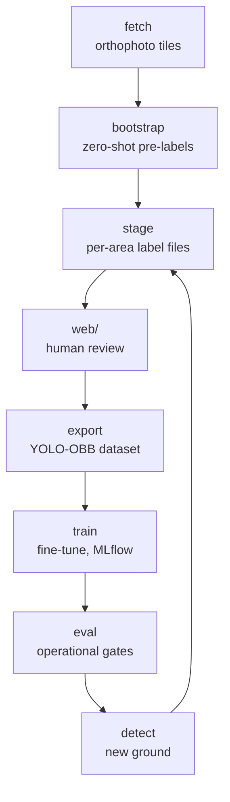

# rekka-ai

Truck (and other vehicle) detection from aerial images.

This is a model-training loop, not a straight-through pipeline: a pretrained
detector proposes, a human corrects, and each round the improved model
proposes the next batch on new ground.



Round one starts at `bootstrap` with off-the-shelf weights; every round after
that starts at `detect` with the weights the previous round produced.

## Requirements

- [uv](https://docs.astral.sh/uv/)
- Python 3.14+ — `uv` installs it for you if it is missing
- [bun](https://bun.sh/) — for the `web/` labelling tool only

## Quick start

```sh
git clone git@github.com:ForumViriumHelsinki/rekka-ai.git
uv sync
uv run rekka-ai --help
```

### Areas of interest

Areas live in `aois/helsinki.yaml`, in EPSG:3067 (ETRS-TM35FIN).
Each area carries a `role` (`positive`, `hard-negative`, `sparse`) and a
`split`:

```sh
# List the areas, and report any that overlap each other
uv run rekka-ai aois --aoi aois/helsinki.yaml

# Fetch one area (default: latest flight year, z16 = 12.5 cm/px)
uv run rekka-ai fetch --aoi aois/helsinki.yaml --name tattariharjuntie

# Or every area in the file. --dry-run reports the tile count and stops.
uv run rekka-ai fetch --aoi aois/helsinki.yaml --dry-run
```

For ad-hoc peeks outside the collection, `--aoi` also accepts a GeoJSON path
or a bare `min_x,min_y,max_x,max_y` bbox (both take `--crs`, default
`EPSG:4326`). Anything entering the labelling loop belongs in the YAML,
though: staged labels are keyed by area name, and an ad-hoc bbox has none.
A YAML collection declares its own `crs`, which always wins over `--crs`.

### Pre-annotation

`bootstrap` runs a DOTA-pretrained oriented-box detector over an area and
writes candidates for a human to correct — correcting is far faster than
drawing boxes on blank imagery. It needs the `detect` extra, which pulls in
torch:

```sh
uv sync --extra detect

# One area
uv run rekka-ai bootstrap --aoi aois/helsinki.yaml --name tattariharjuntie \
    --out data/candidates/tattariharjuntie.geojson

# Every area with a given role — the labelling batch
uv run rekka-ai bootstrap --aoi aois/helsinki.yaml --role positive \
    --min-length 4.0 --out data/candidates/round1.geojson
```

A whole labelling batch is named by **round** — a single-area peek by its area,
as above. `--role positive` is a filter every round passes, so it distinguishes
nothing, and the areas are in the file anyway: each feature carries its `aoi`,
which the collection maps back to a role. What a file cannot tell you is which
model proposed its boxes, and that is what the round number records.

The labelling batch uses `--min-length 4.0` rather than the 6 m default: vans
are a labelled class of their own, and the 5–6 m band is exactly where they
live — over the current 17 positive areas that is 713 candidates at 4.0 m
against 559 at 6 m, so a quarter of the batch would otherwise never be seen.
See docs/DESIGN.md §5.

Output is a GeoJSON of oriented polygons carrying `length_m`, `width_m`,
`heading_deg`, `confidence`, and the source layer. Coordinates are **EPSG:3879**
metres, declared by a `crs` member rather than the WGS84 RFC 7946 assumes — see
docs/DESIGN.md §2. GDAL-based tools (QGIS, `ogr2ogr`) honour it; for anything that
does not, convert with `ogr2ogr -f GeoJSON out.geojson -t_srs EPSG:4326 in.geojson`.

### Labelling

Split the candidates into per-AOI label files under `labels/` — version
controlled, because labels are the one artifact that cannot be regenerated:

```sh
uv run rekka-ai stage --candidates data/candidates/round1.geojson
uv run rekka-ai progress          # per-area review counts, and schema problems
```

`stage` never overwrites a file that already exists unless `--force`: re-running
the detector must not discard hours of correction.

Then review them in the labelling tool — a local SvelteKit app over the same
orthophoto WMTS:

```sh
cd web && bun install && bun run dev     # http://localhost:3000
```

Click an area, then:

| key | |
|---|---|
| `T` / `B` / `V` | classify as truck / bus / van |
| `X` | reject (kept as a hard negative, not deleted) |
| `N` / `P` | jump to next / previous unreviewed candidate |
| `D` | draw: click the nose, click the tail, scroll for width, click or `Enter` to place |
| wheel | vehicle width once the tail is set, while drawing |
| `Esc` | redo the in-progress sketch, or stop drawing |
| drag | move the selected box |
| `⇧` scroll | width of the selected box |
| `↑` / `↓` | length of the selected box (`⇧` coarse) |
| `←` / `→` | rotate the selected box (`⇧` coarse) |
| `Del` | delete the selected box |
| `⌘/⌃ Z` | undo the last change |
| `⌘/⌃ S` | save now |

Drawing is a **centreline**, not four corners: measured over the candidates,
width varies by 0.37 m while length varies by 4.32 m, so only the axis is worth
drawing by hand. Edits save automatically back to `labels/<aoi>.geojson`, so
`⌘/⌃ Z` is the safety net for a mis-drag rather than "don't save yet" — a burst
of arrow-key nudges undoes as one action, not one press at a time.

The surrounding areas are drawn on the map too, in a quieter outline with their
name. Clicking one opens it, so moving to the next area does not mean going back
to the sidebar.

Areas with `role: hard-negative` — `rastila`, `marjaniemi` — sit under **Not
staged** at 0/0, and that is correct rather than a job left undone: no candidates
are staged for them and there is nothing to review. Their contribution is the
imagery itself, exported as background, so the model learns that motorhomes and
moored boats are not trucks. See docs/DESIGN.md §5.

### Training

`export` turns the reviewed files into a YOLO-OBB dataset under
`data/dataset/` — split by whole AOI from the collection's `split` field,
never at random, so adjacent near-duplicate windows cannot straddle train and
validation. It refuses to run while any area has unreviewed candidates, schema
problems, or a box whose centre has drifted outside its area: pixel labels are
baked to a zoom and tiling, so errors baked with them are expensive to find
later. The last check exists because that failure is otherwise silent — a box
dragged off its area lands in no export window at all, so it does not become a
bad label, it stops being a label.

```sh
uv run rekka-ai export --aoi aois/helsinki.yaml
```

`train` fine-tunes the bootstrap weights on that dataset — Ultralytics owns
the loop, MLflow owns the record (`runs/mlflow.db`). Needs the `train` extra:

```sh
uv sync --extra train
uv run rekka-ai train --name round1       # autobatch, dataset's own 1024 px windows
uv run rekka-ai train --batch 2           # small or display-shared GPU

# Inspect runs
uv run mlflow ui --backend-store-uri sqlite:///runs/mlflow.db
```

### Evaluation, and the loop closing

`eval` judges a weights file against the ship gates — truck recall ≥ 0.90 and
precision ≥ 0.85 at a PR-chosen operating confidence, per-area counts within
10%, negative-role areas silent (see docs/DESIGN.md §7):

```sh
uv run rekka-ai eval --weights runs/train/round1/weights/best.pt \
    --aoi aois/helsinki.yaml
```

`detect` is bootstrap's machinery pointed at new ground with the trained
weights — same windowing, seam merging, georeferencing — and its output
stages into label files for the next correction round. The region can be real
polygons (postcode areas, districts), not just bounding boxes:

```sh
uv run rekka-ai detect --aoi aois/helsinki.yaml --name jatkasaari \
    --weights runs/train/round1/weights/best.pt \
    --out data/detections/jatkasaari.geojson

uv run rekka-ai stage --candidates data/detections/jatkasaari.geojson
# review in web/, export, train — the loop repeats
```

Each round the model proposes and the human only corrects; the correction
count per round measures how much the model still misses.

### Choosing round-2 areas (`mine`)

After round 1 is trained and evaluated, do not hand-pick more obvious yards.
`mine` proposes the next batch from OpenStreetMap industrial landuse and the
trained weights:

```sh
uv sync --extra detect
uv run rekka-ai mine \
    --weights runs/train/round1/weights/best.pt \
    --operating-confidence 0.17 \
    --existing aois/helsinki.yaml \
    --out data/mining/round2.yaml \
    --dry-run          # eligible cells + tile estimate; no imagery, no GPU
```

A real run writes `data/mining/round2.yaml` (collection-shaped proposals) and
a sibling `.geojson` report with the signals that justified each pick. It
**never edits** `aois/helsinki.yaml` or `labels/`. Review the GeoJSON, copy
accepted entries into the collection, then `detect` and `stage`. Quiet cells
(no detections) still need an empty label file before export — pass the
proposal collection to stage:

```sh
uv run rekka-ai stage \
    --candidates data/detections/round2.geojson \
    --aoi data/mining/round2.yaml
```

Helsinki only for now: the 2025 5 cm WMTS covers Helsinki. Espoo and Vantaa
are deferred until an HSY imagery source exists. OSM responses are cached
under `data/osm/` (gitignored); `--refresh-osm` re-fetches. Attribution:
© OpenStreetMap contributors.

### Rebuilding from scratch

Everything under `data/` and the unreviewed `labels/` files can be regenerated
end to end — fetch the tiles, detect, split into per-area files, report:

```sh
uv run rekka-ai fetch --aoi aois/helsinki.yaml
uv run rekka-ai bootstrap --aoi aois/helsinki.yaml --role positive \
    --min-length 4.0 --out data/candidates/round1.geojson
uv run rekka-ai stage --candidates data/candidates/round1.geojson
uv run rekka-ai progress
```

The chain is deterministic: same collection, same weights, same zoom — same
candidates. Change any of the three and the difference you see is that
change, not run-to-run noise. Reviewed labels are the exception — delete
`labels/` and they are gone, which is why `stage` refuses to overwrite them.

Tiles land under `data/cache/<layer>/<zoom>/<col>/<row>.jpg`. Imagery for a past
flight year never changes, so the cache is never invalidated and re-runs are
free.

Imagery is © Helsingin kaupunki, Kaupunkimittauspalvelut.

## License

Two licenses, split along the codebase's own boundary:

- **The Python backend** (everything outside `web/`) is
  [AGPL-3.0](LICENSE), because it builds on Ultralytics YOLO, which is
  AGPL-3.0. That includes serving it: offering the detector over a network
  gives those users the right to the source.
- **The labelling web app** (`web/`) is a separate work, communicating with
  the backend only through data files — it is [MIT](web/LICENSE), so it can
  be reused freely in other projects.

## Development

```sh
uv run ruff check      # lint
uv run ruff format     # format
uv run ty check        # type check
uv run pytest          # tests

cd web
bun run test      # labelling-tool tests (bun run, not bun test: bare
                  # `bun test` is bun's own runner, not vitest)
bun run check     # svelte-check
bun run lint      # prettier --check
```

CI runs both the Python four and the web three on every pull request and push
to `main`.
